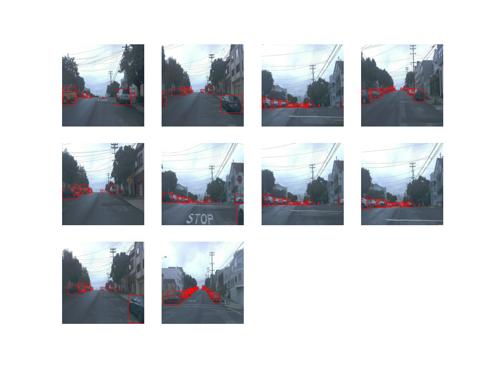
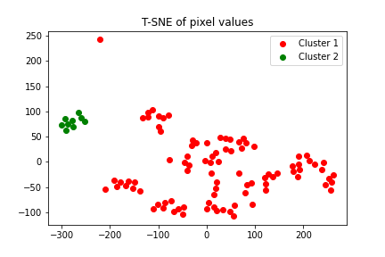
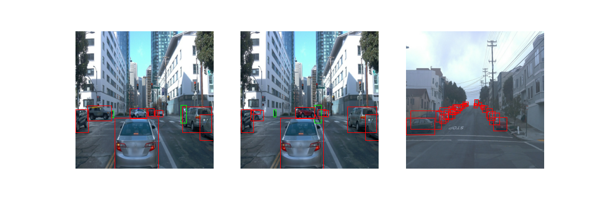
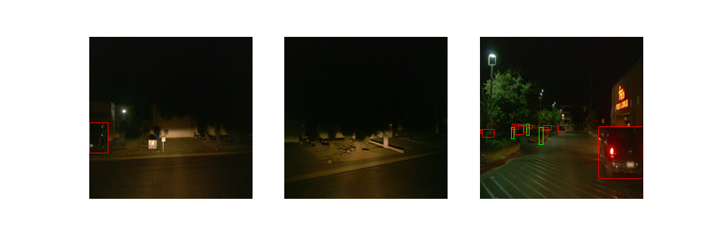
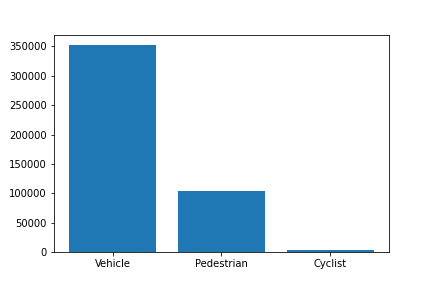
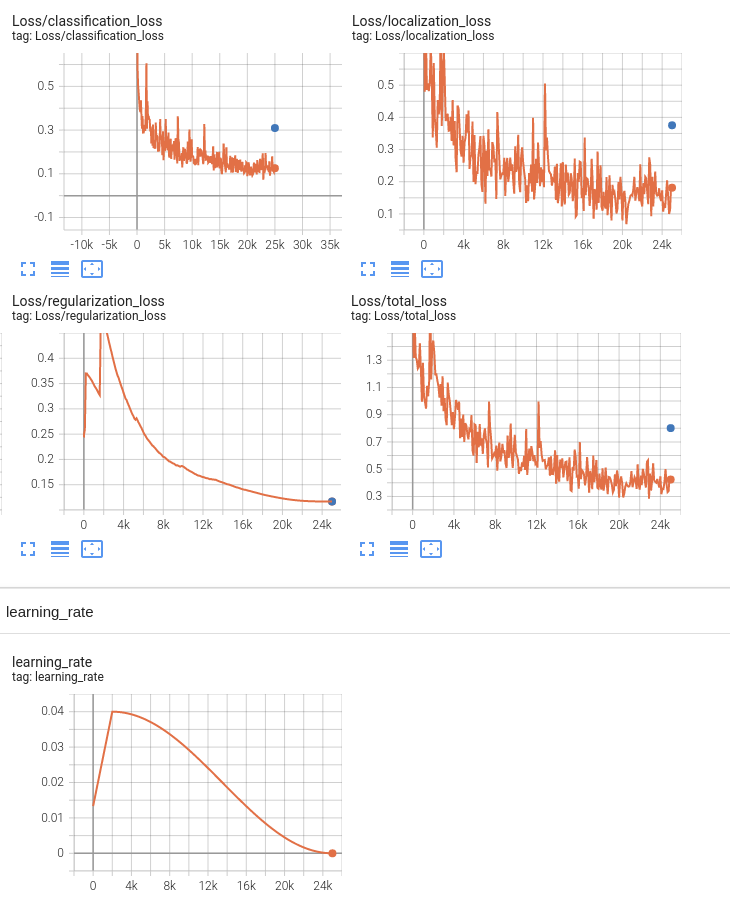

# Object Detection in an Urban Environment

### Project overview
In this project, we look at object detection in camera images. Object detection has a wide variety of application, but for this course we are specifically interested in the application of self driving cars, where object detection is used for scene understanding. Good scene understanding is important for reliable driving. 

### Set up

A local setup was used, as there were minor and major issues with the provided workspace including too little space for processing the files and larger jupyter notebooks, crashing internet browser etc.

To run the code, Anaconda is recommended. Python 3.8 was used. See requirements.txt for the required python packages. It is also required to install the Google Cloud SDK and has to be added to the path. Additionally the Tensorflow Object Detection API is necessary, commit `3db445c7b0404f9b98cbc47616bab08bfa3d8130` was used to create the report, see [here](https://tensorflow-object-detection-api-tutorial.readthedocs.io/en/latest/install.html) for the installation process. One has to apply to the [Waymo open dataset](https://waymo.com/open/) and install the python package and then run the `launch_download.sh` to download the data and preprocess it. To create the videos ffmpeg has to be also installed, one can check on linux whether the binary is accessible in the path using `which ffmpeg`.

### Dataset
#### Dataset analysis - A quantitative and qualitative description of the dataset

Here we try to understand our dataset by a quantitative and qualitative analysis. By plotting images from different files we can tell that they are from seperate rides, we created an animation of one ride, see the file [here](./visualizations/one_ride.mp4) and the following 10 images from one ride:

Using cluster analysis on the mean and standard deviation of pixel values we can see there are at least two clusters, the first being day driving and the second during the night:

Cluster 1:

Cluster 2:

But we can see there are only 9 files in our dataset for night driving which we may take into account during data splitting.

We count the occurances of the different classes and show them in the following figure

we can see that there are much fewer bounding boxes for cyclists in the dataset which we will have to be careful about when splitting the dataset.

#### Cross validation

One common way to do splitting is to just do random splits, however since this data has similar characteristics to time series prediction, randomly splitting across the whole dataset could potentially underestimate the error in practice. Instead, the course guidelines suggest to just split in terms of files, this approach should not suffer from the afformentioned problem. Having decided on just splitting in terms of files, we now have to decide on the splitting of the files. We decided on a 70%, 15%, 15% split and have formulated an objective in terms of the class balance and day/night scenario balance in the train, validation and test set. This objective then was minimized using a simulated annealing approach (see the jupyter notebook for details) to compute the resulting splits saved to the files `filenames_training.txt`, `filenames_validation.txt` and `filenames_test.txt`.

### Training 
#### Reference experiment
Here the `edit_config.py` was used to create a `pipeline_new.config` which the reference model was trained with. The model was then also evaluated using the validation set which is shown as the blue dot in the following plots, whereas the training metrics are shown in orange.

Unsurprisingly, as a pretty small dataset was used, the model was overfitted. In the following section augmentations were added to reduce the overfitting.

#### Improve on the reference
This section should highlight the different strategies you adopted to improve your model. It should contain relevant figures and details of your findings.
 
## TODO
See "5. Submission" for which files have to be in the submission and repository

* ~~Git~~
* ~~Exploratory Data Analysis~~
* ~~Create the splits~~
* ~~Edit the config file~~
* ~~Training of rerence model~~
* Improve the performances
* * Explore augmentations
* Creating an animation
* Class level metrics
* Run the pep8 package
* requirements.txt
* More writing
* Check [Review criteria](https://review.udacity.com/#!/rubrics/2940/view) again
